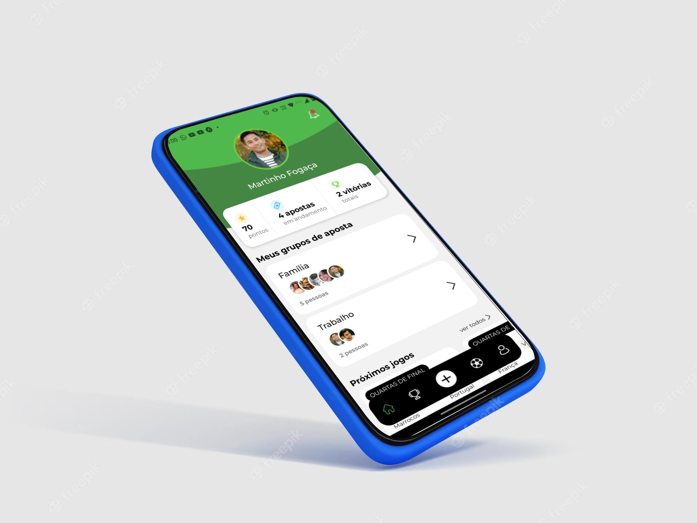
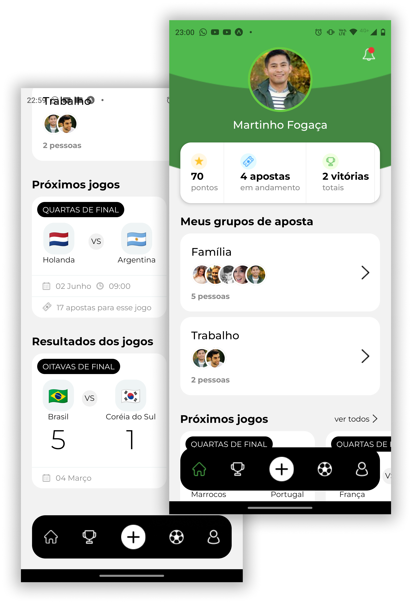
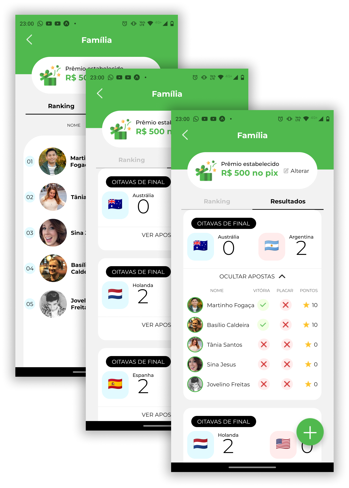
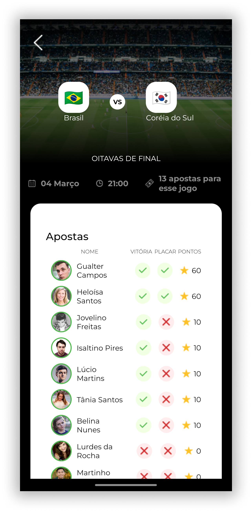
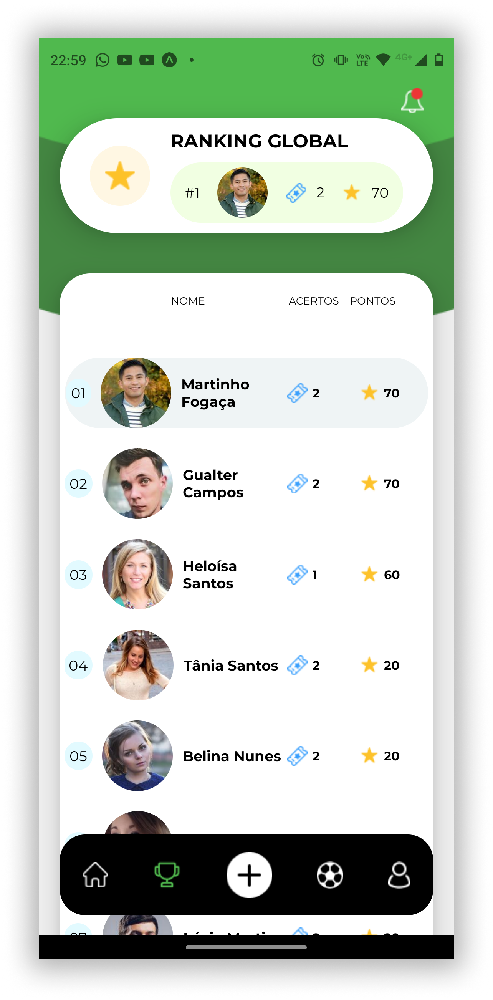
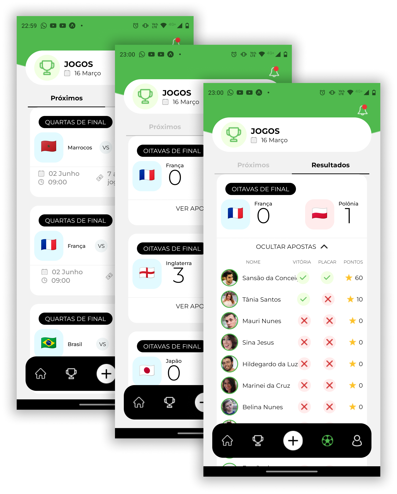
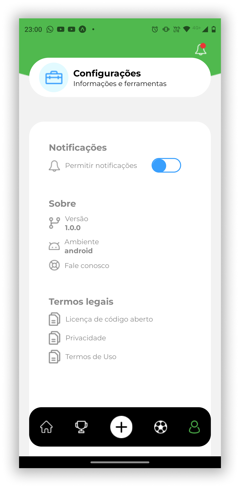

# App - World CUP ⚽

# Description

This is a **react native** based application to simulate bets and guesses on the world cup tournament.

> Its designed for Android use only.

> The UI is in brazilian portuguese 🇧🇷

## Usage

https://user-images.githubusercontent.com/87976167/225797798-2a22db56-4793-41ab-8f06-bfe54422e1a1.mp4

## App pictures

<table>
  <tr>
  <td width="400">
    

    
     Track your progress
    

  </td>
  <td width="400">
    

    
     Create groups
    

  </td>
  </tr>

  <tr>
  <td width="400">
    

    
     See the bets results of your friends
    

  </td>
  <td width="400">
    

    
     Go for the top spot!
    

  </td>
  </tr>

  <tr>
  <td width="400">
    

    
     Track the results of games and plan your next moves!
    

  </td>
  <td width="400">
    

    
     Info and settings available
    

  </td>
  </tr>

</table>

<!--    -->

# Features

- Rank system
- You can manage your own groups
- See other peoples bets and compete with your friends
- Nail the scores to earn more points
